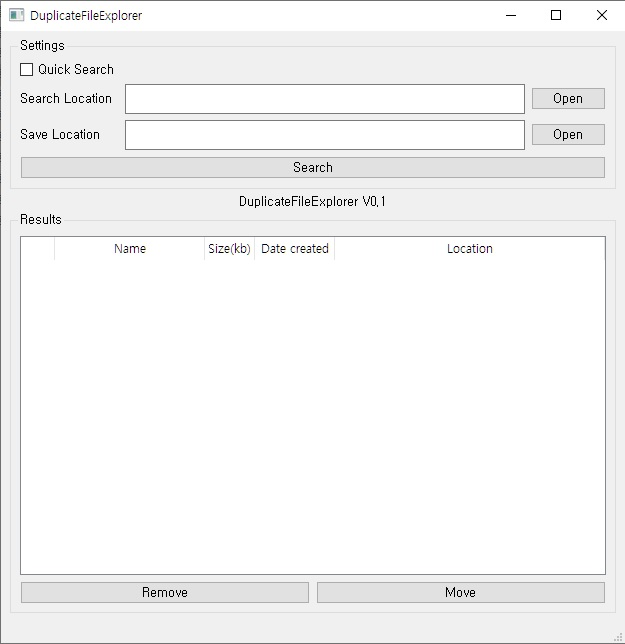
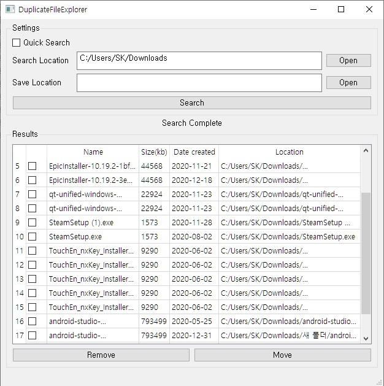

# DuplicateFileExplorer
지정된 폴더에서 중복파일들을 검사하여 제거/특정폴더로 이동합니다.  

## Manual

### Button Description  
Search Location : 중복파일을 검색할 경로를 지정합니다.  
Save Location : 중복파일을 다른 폴더로 이동할 경로를 지정합니다.  
Search : 중복파일을 검색합니다.  
Remove : 선택한 중복파일을 휴지통으로 이동시킵니다.  
Move : 선택한 중복파일을 Save Location에서 지정한 폴더로 이동시킵니다.  
Quick Search : 정확성이 떨어지는 빠른탐색을 수행합니다.  

### Sequence
1. Search Location, Save Location을 Open버튼을 눌러 입력합니다.
2. Search버튼을 클릭합니다.
3. Results에서 작업을 수행할 중복파일을 체크합니다.
4. Remove 혹은 Move 버튼을 눌러 중복파일을 삭제/이동합니다.

## Version History
0.1 : Initial Version  

## Logic
Quick Search : 하위폴더를 포함한 폴더 내 파일들의 파일명과 파일크기가 같다면 중복파일로 확인합니다.  
Normal search : 하위폴더를 포함한 폴더 내 파일들의 Checksum(MD5)이 같다면 중복파일로 확인합니다.

## Development Environment  
OS : Windows10  
Language : C++11  
GUI Framework : QT 5.15.2  
Compiler : MSVC2015  

## Work Speed Test
Quick Search : 3TB 측정 소요시간  
 : 10초 미만  
  
Normal Search :  700MB 측정 소요시간  
 : HDD 15초 미만 / SSD 5초 미만  

## Screenshot  

